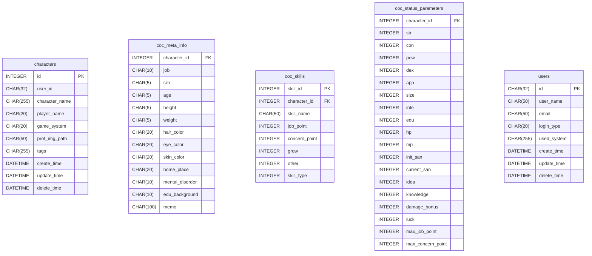

```mermaid
erDiagram
    characters{
        INTEGER id PK
        CHAR(32) user_id
        CHAR(255) character_name
        CHAR(20) player_name
        CHAR(20) game_system
        CHAR(50) prof_img_path
        CHAR(255) tags
        DATETIME create_time
        DATETIME update_time
        DATETIME delete_time
}
    coc_meta_info{
        INTEGER character_id FK
        CHAR(10) job
        CHAR(5) sex
        CHAR(5) age
        CHAR(5) height
        CHAR(5) weight
        CHAR(20) hair_color
        CHAR(20) eye_color
        CHAR(20) skin_color
        CHAR(20) home_place
        CHAR(10) mental_disorder
        CHAR(10) edu_background
        CHAR(100) memo
}
    coc_skills{
        INTEGER skill_id PK
        INTEGER character_id FK
        CHAR(50) skill_name
        INTEGER job_point
        INTEGER concern_point
        INTEGER grow
        INTEGER other
        INTEGER skill_type
}
    coc_status_parameters{
        INTEGER character_id FK
        INTEGER str
        INTEGER con
        INTEGER pow
        INTEGER dex
        INTEGER app
        INTEGER size
        INTEGER inte
        INTEGER edu
        INTEGER hp
        INTEGER mp
        INTEGER init_san
        INTEGER current_san
        INTEGER idea
        INTEGER knowledge
        INTEGER damage_bonus
        INTEGER luck
        INTEGER max_job_point
        INTEGER max_concern_point
}
    users{
        CHAR(32) id PK
        CHAR(50) user_name
        CHAR(50) email
        CHAR(20) login_type
        CHAR(255) used_system
        DATETIME create_time
        DATETIME update_time
        DATETIME delete_time
}
```