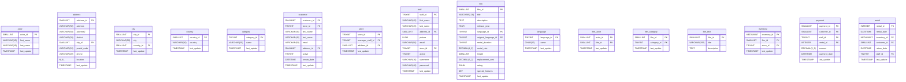

```mermaid
erDiagram
    actor{
        SMALLINT actor_id PK
        VARCHAR(45) first_name
        VARCHAR(45) last_name
        TIMESTAMP last_update
}
    address{
        SMALLINT address_id PK
        VARCHAR(50) address
        VARCHAR(50) address2
        VARCHAR(20) district
        SMALLINT city_id FK
        VARCHAR(10) postal_code
        VARCHAR(20) phone
        NULL location
        TIMESTAMP last_update
}
    city{
        SMALLINT city_id PK
        VARCHAR(50) city
        SMALLINT country_id FK
        TIMESTAMP last_update
}
    country{
        SMALLINT country_id PK
        VARCHAR(50) country
        TIMESTAMP last_update
}
    category{
        TINYINT category_id PK
        VARCHAR(25) name
        TIMESTAMP last_update
}
    customer{
        SMALLINT customer_id PK
        TINYINT store_id FK
        VARCHAR(45) first_name
        VARCHAR(45) last_name
        VARCHAR(50) email
        SMALLINT address_id FK
        TINYINT active
        DATETIME create_date
        TIMESTAMP last_update
}
    store{
        TINYINT store_id PK
        TINYINT manager_staff_id FK
        SMALLINT address_id FK
        TIMESTAMP last_update
}
    staff{
        TINYINT staff_id PK
        VARCHAR(45) first_name
        VARCHAR(45) last_name
        SMALLINT address_id FK
        BLOB picture
        VARCHAR(50) email
        TINYINT store_id FK
        TINYINT active
        VARCHAR(16) username
        VARCHAR(40) password
        TIMESTAMP last_update
}
    film{
        SMALLINT film_id PK
        VARCHAR(128) title
        TEXT description
        YEAR release_year
        TINYINT language_id FK
        TINYINT original_language_id FK
        TINYINT rental_duration
        DECIMAL(4_2) rental_rate
        SMALLINT length
        DECIMAL(5_2) replacement_cost
        ENUM rating
        SET special_features
        TIMESTAMP last_update
}
    language{
        TINYINT language_id PK
        CHAR(20) name
        TIMESTAMP last_update
}
    film_actor{
        SMALLINT actor_id PK
        SMALLINT film_id PK
        TIMESTAMP last_update
}
    film_category{
        SMALLINT film_id PK
        TINYINT category_id PK
        TIMESTAMP last_update
}
    film_text{
        SMALLINT film_id PK
        VARCHAR(255) title
        TEXT description
}
    inventory{
        MEDIUMINT inventory_id PK
        SMALLINT film_id FK
        TINYINT store_id FK
        TIMESTAMP last_update
}
    payment{
        SMALLINT payment_id PK
        SMALLINT customer_id FK
        TINYINT staff_id FK
        INTEGER rental_id FK
        DECIMAL(5_2) amount
        DATETIME payment_date
        TIMESTAMP last_update
}
    rental{
        INTEGER rental_id PK
        DATETIME rental_date
        MEDIUMINT inventory_id FK
        SMALLINT customer_id FK
        DATETIME return_date
        TINYINT staff_id FK
        TIMESTAMP last_update
}
```